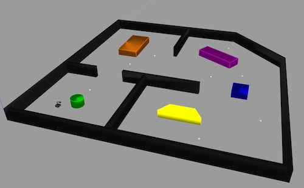
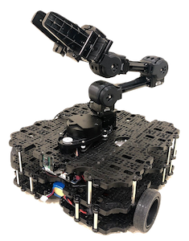
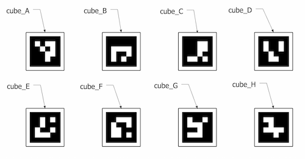
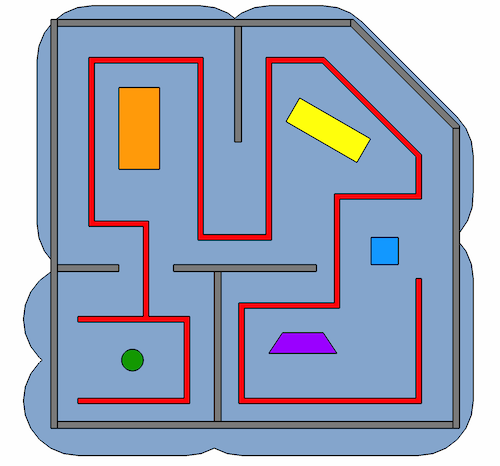

# ROS Collection Robot
[](https://travis-ci.org/Pradeep-Gopal/ros_collection_robot)
[](https://coveralls.io/github/Pradeep-Gopal/ros_collection_robot?branch=main)
[](https://opensource.org/licenses/MIT)
---

## Authors
Sprint 1:
- Driver : Pradeep Gopal
- Navigator : Govind Ajith Kumar
- Design Keeper : Justin Albrecht

Sprint 2:
- Driver : Govind Ajith Kumar
- Navigator : Justin Albrecht
- Design Keeper : Pradeep Gopal

Sprint 2:
- Driver : Justin Albrecht
- Navigator : Pradeep Gopal
- Design Keeper : Govind Ajith Kumar

## Overview
This project is a simulation of an autonomous collection robot in a warehouse setting. The warehouse is a single story building with multiple rooms as well as stationary obstacles for the robot to avoid.



The robot used for this projec a TurtleBot3 with an OpenManipulator arm. The TurtleBot3 is equipped with a camera and 360 degree laser scanner. The 5 DOF OpenManipulator arm is mounted on top of the TurtleBot3 and includes a gripper for grasping objects.



For the simulation the robot is tasked with searching the warehouse building to locate and classify randomly spawned collection cubes. The cubes are marked with [ArUco tags](https://www.uco.es/investiga/grupos/ava/node/26) on all four sides. There are a total of 8 different types of cubes (A-H) each with a unique marker for identification. At the start of the simulation a number of cubes of random types will be spawned in random locations around the map. From this set of spawned cube a subset will be selected as the 'order'. This order is sent to the ROS parameter server for the robot to read. 



It is assumed that the robot has fully mapped the space prior to the start of the simulation. Therefore it has knowledge of the walls and obstacles which it can use while searching. The robot follows a predetermined set of waypoints that ensures that the range of the laser scanner will fully search the space. When the robot detects a collection cube, it approaches and uses the camera to classify the cube type based on the ArUco marker. If the cube is not in the order it is ignored. If it is in the order the robot calls a ROS service to remove the cube from the simulation to demonstrate that it has been collected. Future work on this project will involve the OpenManipulator arm being used to grasp the cube and take it to a specified drop-off area. The robot will follow the search path until the order has been completed or it passes through all the waypoints on the search path.




## Presentation Link
[Link to a presentation of our project.](https://docs.google.com/presentation/d/1QpWUlgShuYL62FFgOE2f1ToSlpFEyMKYMuQuHAgj520/edit?usp=sharing)


[Link to a video explaining our project.](https://youtu.be/G2xqrm-4xio)


## Demo
[Link to a video demo of our project.](https://youtu.be/PCSjduCb0pY)

## Agile Iterative Process (AIP)
This project was completed using AIP with the involvement of 3 programmers using Pair-programming in turns. The detailed Product Backlog, Iteration Backlogs and Work Log are mentioned in the link given below :

[Agile Iterative Process](https://drive.google.com/file/d/1BNjG2if9-G0QJx6BSb_-JIIgaOwBue7m/view?usp=sharing)

## Sprint Planning Notes
[Google Doc Link for Sprint Planning and notes](https://docs.google.com/document/d/1bBEri2t5gSxDZ9FnP-1Wu5RdeCvGUPCNcdnWPu9Y4Dw/edit?usp=sharing)

## Dependencies
For this project, you require the following dependencies

- Ubuntu 18.04
- Git
- ROS Melodic
- TurtleBot3 with OpenManipulator
- Move-It


ROS can be installed from the https://wiki.ros.org site. Click on following link [here](https://wiki.ros.org/melodic/Installation) to navigate to the installation guide for ROS.

If you have not yet created a catkin workspace. Open a new terminal and follow these commands:
```
source /opt/ros/melodic/setup.bash

mkdir -p ~/catkin_ws/src

cd ~/catkin_ws/

catkin_make
```

To install the TurtleBot3 with open manipulator packages and Move-It, Open a new terminal and follow these commands
```
sudo apt-get install ros-melodic-turtlebot3-msgs

sudo apt-get install ros-melodic-turtlebot3

sudo apt install ros-melodic-ros-control* && ros-melodic-control* && ros-melodic-moveit*

cd catkin_ws/src

git clone https://github.com/ROBOTIS-GIT/turtlebot3_manipulation.git

git clone https://github.com/ROBOTIS-GIT/turtlebot3_manipulation_simulations.git

git clone https://github.com/ROBOTIS-GIT/open_manipulator_dependencies.git

cd ..

catkin_make

source devel/setup.bash
```
## Steps to Run the Package

The package will spawn the TurtleBot3 with OpenManipulator in a custom Warehouse environment with obstacles. 

```
cd ~/catkin_ws/src

git clone https://github.com/Pradeep-Gopal/ros_collection_robot.git

cd ..

catkin_make

source devel/setup.bash

export TURTLEBOT3_MODEL= waffle_pi

roslaunch ros_collection_robot warehouse_world.launch

```

To run the navigator node to spawn the cubes and start the collection open a new tab and follow these commands.

```
cd catkin_ws

source devel/setup.bash

rosrun ros_collection_robot navigator

```

## Record a rosbag file
To record a rosbag add that following argument to the roslaunch command

    roslaunch ros_collection_robot warehouse_world.launch rosBagEnable:=true

## Unit Tests

To run the unit test follow these commands

```
cd catkin_ws

source devel/setup.bash

catkin_make run_tests
```