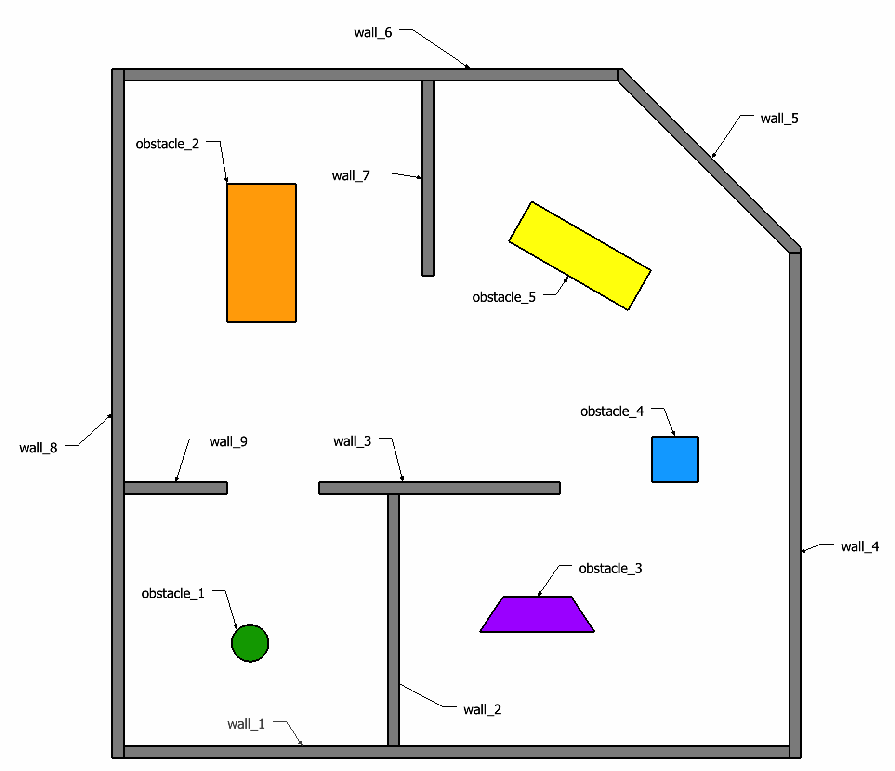

# ROS Collection Robot
[](https://travis-ci.org/Pradeep-Gopal/ros_collection_robot)
[](https://coveralls.io/github/Pradeep-Gopal/ros_collection_robot?branch=main)
[](https://opensource.org/licenses/MIT)
---

## Authors
Sprint 1:
- Driver : Pradeep Gopal
- Navigator : Govind Ajithkumar
- Design Keeper : Justin Albrecht

## Overview
Our proposed idea for ACME robotics is to build a simulation of an autonomous collection robot in a warehouse setting. 
Our robot is tasked with searching the entire building to locate and classify the randomly spawned objects.  The map 
will also have stationary obstacles for the robot to navigate around. Depending on the classification, the robot will 
need to grasp the object and deposit it in the drop zone. 

The robot is deployed in a facility to assemble products with different parts. Boxes with QR codes on its sides contain 
all the parts. The QR code specifies the serial number for the part inside of the cube. Every day during the normal 
operation of the facility, parts are accidentally dropped in random places around the facility. Our robot finds these 
and classifies them using the QR code before drop-off. To start the simulation the robot is spawned into the building 
shown. This building is around 600 square meters and is enclosed with several connected rooms. It is assumed that the 
space has been previously mapped, and the robot has knowledge of the exact location of the walls and obstacles.

At the start of the Gazebo simulation, the robot will receive an order to retrieve a few of the dropped parts. For 
example, the order may contain three parts (2 of part A and 1 of part F). The robot then searchers the space for the 
parts in the order. When it encounters one of the objects it will need to return it to the central receiving area 
(labeled "Drop Zone" on the map). The robot that will be used in the simulation is a Turtlebot3 Waffle with an open 
manipulator arm mounted on top, controlled using MoveIt. It can be controlled by specifying its linear and angular 
velocity using a topic in ROS. We also assume that using the wheel odometry the robot knows its own pose in the world. 
The robot has two sensors, a LIDAR and camera. 



## Agile Iterative Process (AIP)
This project was completed using AIP with the involvement of 3 programmers using Pair-programming in turns. The detailed Product Backlog, Iteration Backlogs and Work Log are mentioned in the link given below :

[Agile Iterative Process](https://drive.google.com/file/d/1BNjG2if9-G0QJx6BSb_-JIIgaOwBue7m/view?usp=sharing)

## Sprint Planning Notes
[Google Doc Link for Sprint Planning and notes](https://docs.google.com/document/d/1bBEri2t5gSxDZ9FnP-1Wu5RdeCvGUPCNcdnWPu9Y4Dw/edit?usp=sharing)

## Dependencies
For this project, you require the following dependencies

- Ubuntu 18.04
- ROS Melodic
- Gazebo 9.x
- Googletest
- catkin
- OpenCV
- MoveIt
- TurtleBot3 with OpenManipulator

ROS can be installed from the https://wiki.ros.org site. Click on following link [here](https://wiki.ros.org/melodic/Installation) to navigate to the installation guide for ROS.

To install the TurtleBot3 with open manipulator packages, Open a new terminal and follow these commands
```
cd catkin_ws/src

git clone https://github.com/ROBOTIS-GIT/turtlebot3_manipulation.git

git clone https://github.com/ROBOTIS-GIT/turtlebot3_manipulation_simulations.git

git clone https://github.com/ROBOTIS-GIT/open_manipulator_dependencies.git

cd ..

catkin_make

source devel/setup.bash
```
## Steps to Run the Package

The package will spawn the TurtleBot3 with OpenManipulator in a custom Warehouse environment with obstacles. 
It also spawns the different objects which has to be collected and delivered by the robot.

```
cd catkin_ws/src

git clone https://github.com/Pradeep-Gopal/ros_collection_robot.git

cd ..

catkin_make

source devel/setup.bash

roslaunch ros_collection_robot warehouse_world.launch
```